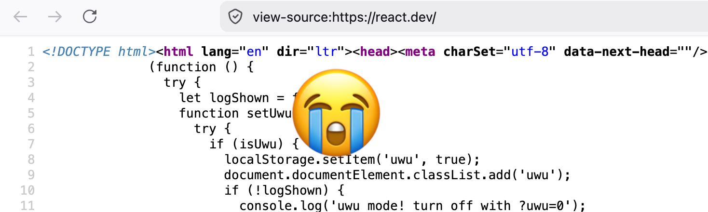

This week during the inaugural [Write Through It](https://youtu.be/w3kV6JtJFIw) we got onto the subject of View Source. Kin reflected on what [the loss of this pathway](https://kinlane.com/2026/07/01/view-source-is-dead/) means for opportunity and the web over on his blog, which got me thinking about it once again.

<!-- excerpt -->

View Source was the ability to right-click on a web page and see its source code. It was a learning path many used to acquire developer skills. Its usefulness had [already been compromised](https://www.sue.codes/blog/convenienceunderstanding/) by changes in the way we build websites. First, processing shifted to the server side, rather than the client where those browser tools could provide illumination. Then, as front-end embraced generated static site frameworks, what the browser could see became the much more complicated scripted output of a build tool.

## The ghost of view source still haunts us

[Glitch tried to keep the spirit of View Source alive](https://thenewstack.io/glitch-brings-view-source-philosophy-to-react-node-js/) by exposing the functionality that powered websites using those server and generated front-end frameworks, but of course the web continued to grow in complexity.

A while back we got a smart telly in our house, which has an Android operating system running the apps for streaming services and the like. I had the fun challenge of trying to explain to my partner that he was interacting with the TV operating system and not the Netflix app one day as he was trying to search for a movie. I asked myself how I knew, and the only tangible signs I could point to were subtle UI indicators. It occurred to me that the experience of **not being able to orient yourself in a technological context** is getting increasingly common.

> I might have called this [platform cultivated context ambiguity](https://glasgow.social/@sue/114642396769301405) over on mastodon lol.

## The road was paved with APIs

For a long time I worked in and around APIs. My goal was helping people understand how we combine these lego block components into a cohesive user experience. APIs and dependency ecosystems paved the way to the web we find ourselves with today. They are also a huge part of what makes AI agents able to be _a thing_. 

These forms of abstraction have enabled automation that powered creative uses of data and processing on an incredible scale. As we watched this happen, we also saw it getting harder to understand how our systems worked, and harder to maintain reliability. Entire specialties in software grew out of the need to support all of this.

On top of the complexity-induced confusion, we’ve also witnessed a significant amount of intentional obfuscation. From platforms hiding their underlying algorithms, to gatekeeping developer culture promoting over-engineered implementations – making it increasingly challenging for new people to enter the field.

## AI and obfuscation

What stresses me out the most about LLM code generation is exactly this. I don’t think the average developer would choose to deploy a solution they did not understand, but the economic conditions make it inevitable. We’ve leapt headlong into a situation where systems are in operation having had little to no inspection of their implementation. For the companies selling this tooling and those investing in them, the prospect of undermining labour makes the [loss of comprehension a feature](https://www.sue.codes/blog/forwarddeployed/) and not a bug.

Since I started in tech, my career has been shaped by a compulsion to force the machines to illuminate themselves to human beings, often using interfaces that were extremely not designed to support that. As it happens language models are quite helpful for this. I’m working on tooling to aid codebase comprehension, not necessarily on a line by line basis, but at a different level of fidelity – I think that's necessary given the mountain of code we’re drowning in. It might not be View Source, but hopefully it’ll be something.
