This week I'm talking at [Monki Gras](https://monkigras.com/) about developer learning and AI. 

Here's my deck:

* [Do your fingers remember how to code – slides](https://docs.google.com/presentation/d/1bwSZalwQHD5p1t0ivBa3nuCD4D97xJX1V9jLZam7syo/edit?usp=sharing)

And here are some links I mentioned:

* [Why kids still need to learn to code in the age of AI – Raspberry Pi Foundation](https://www.raspberrypi.org/blog/why-kids-still-need-to-learn-to-code-in-the-age-of-ai/)
* [Making the Implicit Explicit talk – Erin McKean](https://developerrelations.com/talks/making-the-implicit-explicit/)
* [Semantic Waves – National Centre for Computing Education](https://teachcomputing.org/blog/quick-read-6-semantic-waves)
* [Learning Opportunities repo – Dr Cat Hicks](https://github.com/DrCatHicks/learning-opportunities)
* [My DevRelCon talk about Developer Learning](https://developerrelations.com/developer-education/an-open-framework-for-developer-learning)

My other posts on the subject:

* [We should still teach coding](https://www.sue.codes/blog/stillteach/)
* [What is worth learning?](https://www.sue.codes/blog/worthlearning/)
* [Software development isn't writing syntax](https://www.sue.codes/blog/notsyntax/)

## Transcript

Here's a rough transcript of the talk, will likely be doing it again later in the year so will hopefully be able to share it in video form.

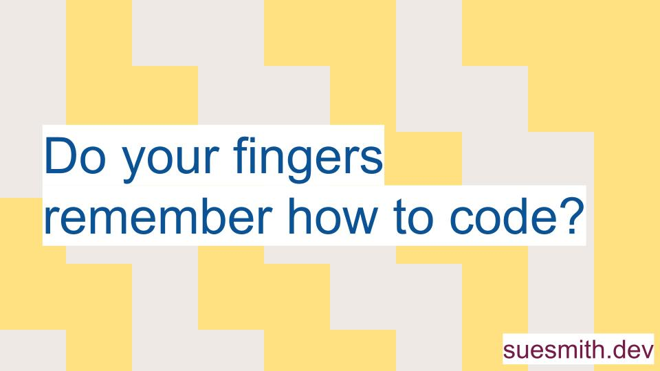

I’m going to talk to you about developer learning in the context of AI assisted coding. You can access the deck and links at [suesmith.dev](https://www.suesmith.dev).

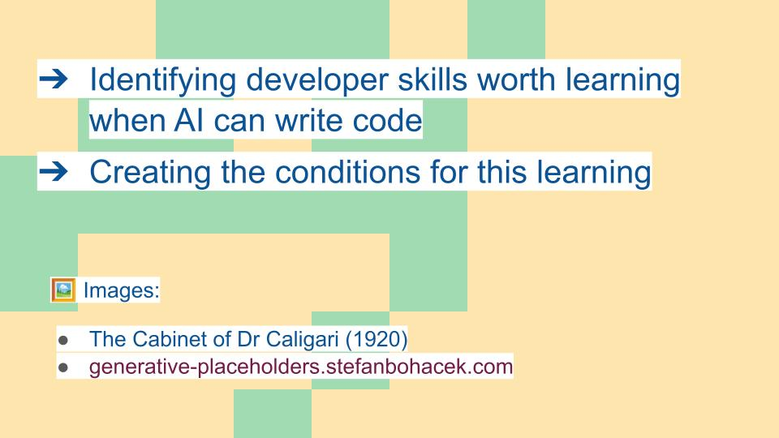

I am part of a small cohort of people who specialise in developer learning in industry settings. I think there are about 9 of us. A lot of people are asking for advice about which developer skills we should be teaching right now. The truth is that I don’t know. I have some suspicions! But it really needs to be tailored to your own context, your software, your teams, your organisational priorities. What I can do is point at some techniques for discovering what developer skills even are, because it turns out we don't have a great conception of them. And I can outline some strategies for helping people learn them.

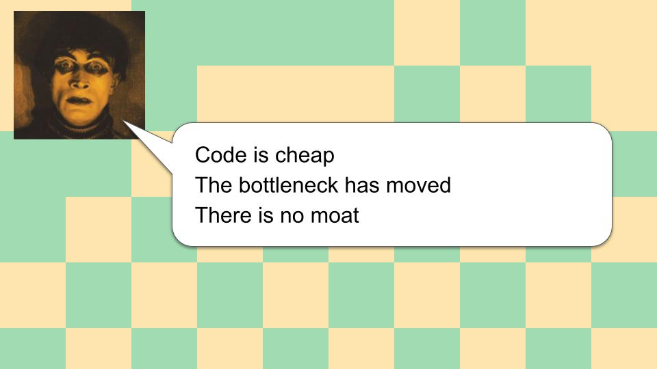

First things first. This is LinkedIn obviously. The proclamations of doom. Bottlenecks and moats and all that. I have been involved in a number of organisational change initiatives over the years, and one thing they typically have in common is that they take a long time. So this idea that entire professions are being made obsolete overnight, I think we can take that with a pinch of salt. There are digital transformation initiatives still in operation...

I can't really point fingers, because I worked in devrel. But I was fortunate enough to also have friends who work in software but for normal boring companies where they don't chase whichever technology is flavour of the month. And they would routinely ridicule me for the nonsense I was purveying in devrel. It was a good reminder, the technologies that feature in the discourse are overwhelmingly not a reflection of what's happening in the world. The world beyond the veil of hashtags, is where we'll find out the utility of this very new technology, on the slower path.

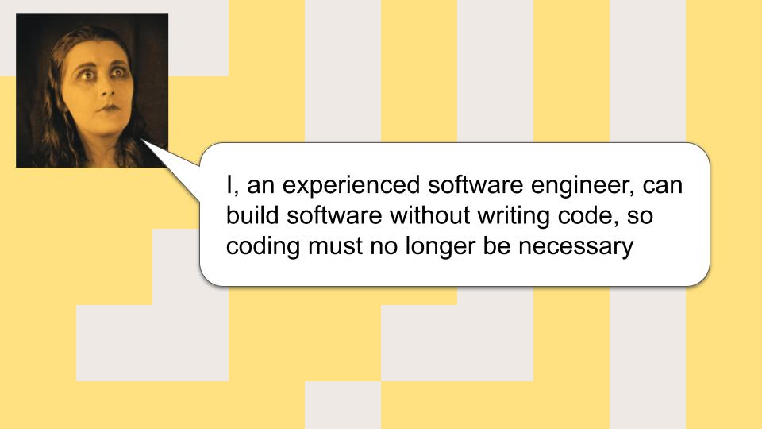

Let’s look at another take that might lead us in a more constructive direction. This is typical of what we were seeing maybe a year ago. Someone who already knows how to write code uses AI to generate code effectively and comes to the conclusion no one needs to know about code anymore.

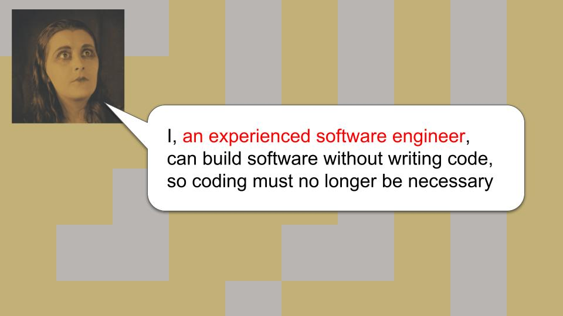

But I think we have a better handle on this already. We’re seeing a clear divergence between experienced developers and those early in their career. Experienced developers seem to be getting better use from LLMs for codegen. And there’s an increasing concern that early career developers are not acquiring the foundation skillset that they'll need. So there’s a disconnection.

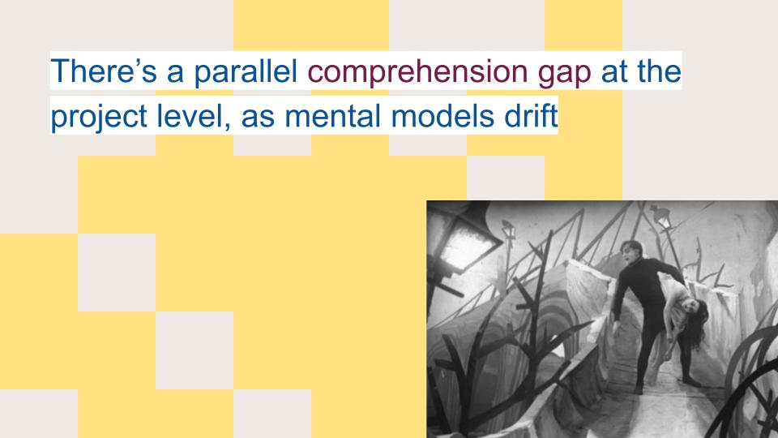

And there’s a parallel gap at the project level. As developers using AI to generate code find their ability to build solid mental models of a codebase start to drift. This might be partly anxiety but there are indicators that this comes at a cost. It might be related to the increased rework we see on projects that rely heavily on AI code generation, and the slower incident mitigation. We're missing something intangible that I'd like to explore.

I’m gonna take you back to 1984, the movie Paris Texas. These two brothers are driving across America. One of them has been stranded in the desert for years, he hasn't spoken to anyone for a long time, and his brother is taking him back to where he lives. And they are discussing sharing the driving, so he asks him if he remembers how to drive, and he says my body remembers.

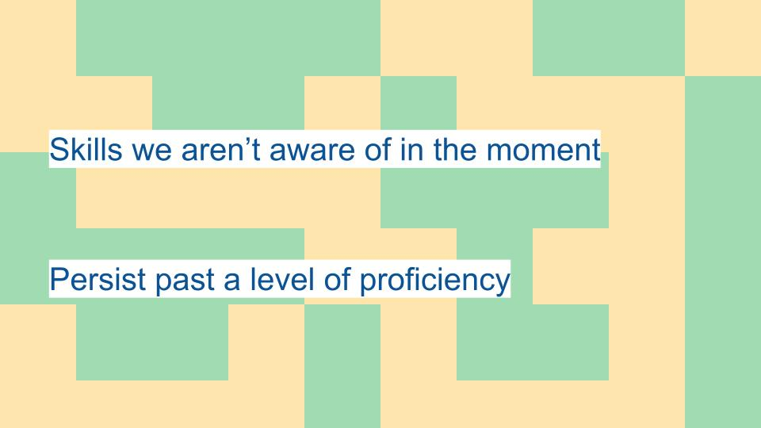

A lot of our skills work like this. We aren’t aware of them in the moment, as we apply them. Some of them are motor skills. If you drive, you might have had the experience of driving somewhere and having no memory of the drive. Your body was driving. But it also applies to other skills. With coding it can be instructive to consider natural language skills like reading and writing. Once you reach a level of proficiency you can read without being aware that you're applying the skill of reading. 

And once you reach a level of proficiency some skills appear to become persistent. You could not see written language for a long time and would probably still be able to read, unless something else had happened to you.

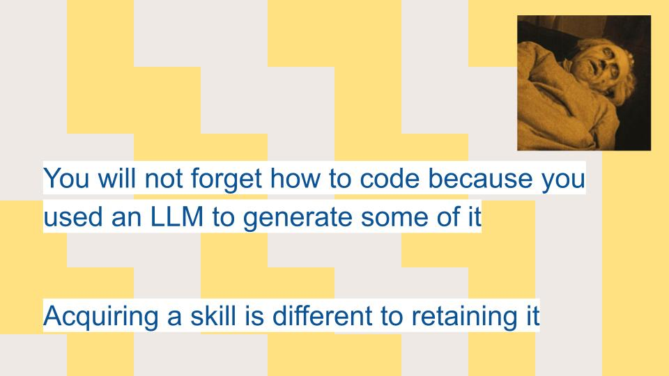

A sidebar on this. I do not believe that you will forget how to code because you used AI to generate some of it. You might get rusty on the syntax of a particular language, but that’s normal, we’re always learning new languages, frameworks, techniques. We don’t remember the detail of every one we've used, but we haven’t forgotten how to code. And if you had to go back to coding the old fashioned way without LLMs, you would be fine, you would pick it back up. What we can’t take for granted is that new developers are able to reach the level of proficiency that gives them the foundation they will need later.

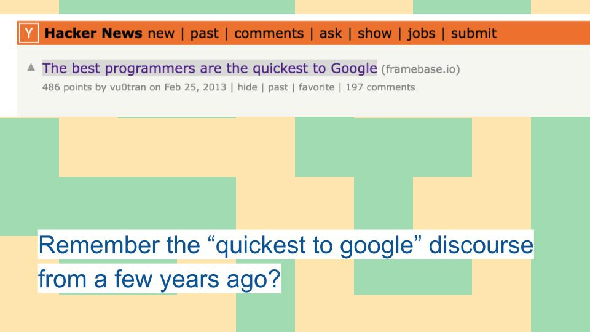

Remember this from a few years ago, 13 apparently. The idea was that we shouldn’t measure programmer ability by the ability to remember syntax. That we could kind of outsource remembering to the machine and still be a good programmer. What was most valuable was more abstract than that. We’ve been through this moral panic a few times haven’t we, can you copy and paste from Stack Overflow and still be a good programmer. 

But when we look at the trajectory of a senior engineer, we see someone who spends less time touching code, whose skills are more abstract and not dependent on the detail of a particular implementation. It could be that we can retain a similar trajectory as people move a bit further from the implementation. But we'll have to do it with intention, it won't happen by accident.

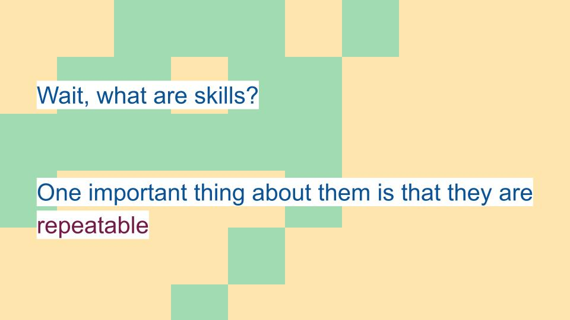

As an educator I can’t meaningfully say that I’ve helped someone acquire a skill if they don’t leave me with the ability to do something repeatable. If it's not repeatable it's not a skill. That’s why framing prompts as a programming abstraction is problematic from an education standpoint. Because it's not repeatable enough. The natural language input is not specific enough and the LLM output is not predictable enough to create the kind of repetitive feedback loop we use when teaching programming skills. It would be easier for me to teach those skills using a high level programming language, where we see a similar enough result for the same action.

There was a fantastic talk a few years ago from Erin McKean at devrelcon a few years ago. It was called "making the implicit explicit" and was about the process we go through as educators, as we try to discover implicit skills and knowledge, and make it explicit so that we can teach it to others. And we can all benefit from doing this.

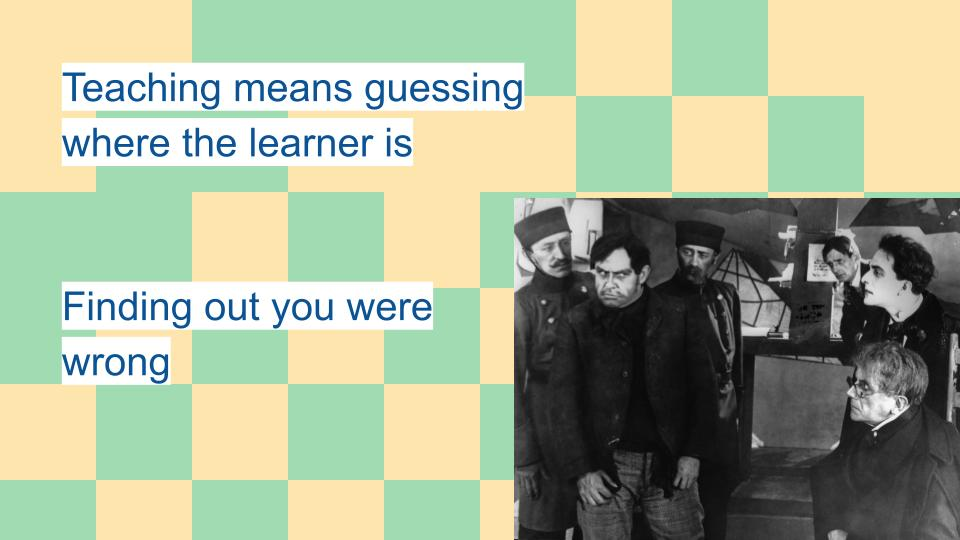

I run employee training at my work, I teach teams within the company to use our product. And when I first proposed this it was met with skepticism, some people thought that teaching our technical product to teams they didn't regard as technical would work. But I was insistent about doing it. 1 because I’m delusional enough to think I can teach anyone anything, and 2 because it’s a cheap way to test my training resources before we put them in front of customers. 

So I would start by guessing what the learners already knew and what needed explained, you need to go where the learner is to take them where you want to get them. I would guess what they already knew and create a space where they felt able to tell me I was wrong, and they’d no idea what I was talking about. I hadn't explained things that needed explained. I would feed that back into the process and go again. So it was a process of revealing my own assumptions to me.

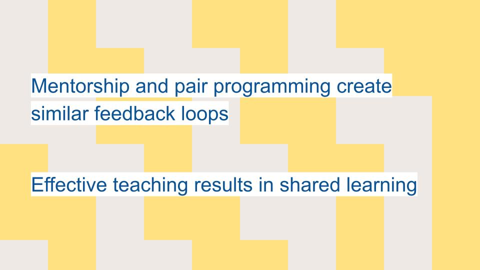

A similar feedback loop happens when we do pair programming and mentorship. Someone more experienced guiding someone less experienced, we discover our own implicit knowledge. And although we talk about a teacher and learners, what we can see is that the teacher is also learning. They’re learning about their own assumptions. Ideally we want to create an opportunity for shared learning.

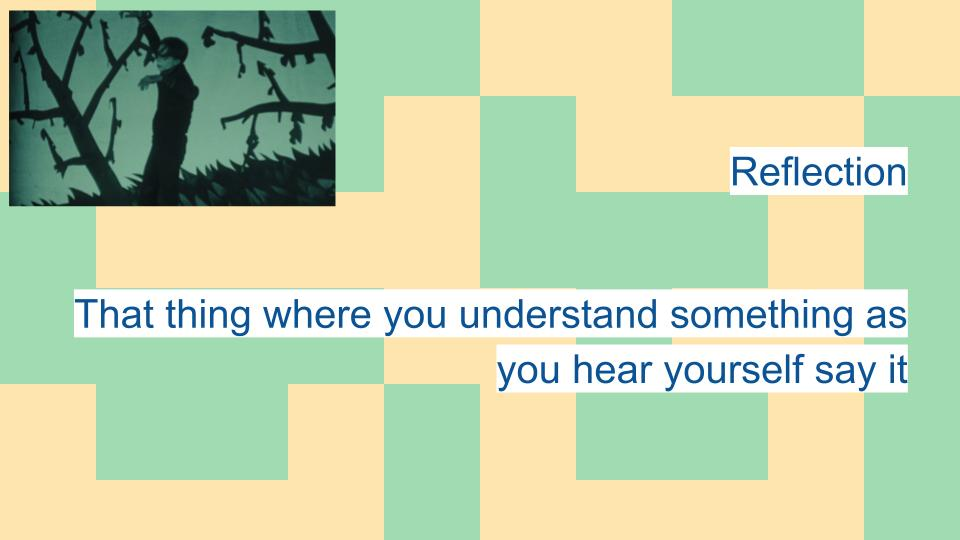

A case in point is the value of reflection in learning. Did you ever have that feeling of hearing yourself say something and in that moment feel like you were understanding it yourself for the first time? Often we verbalise something, we put it into words in order to pull it from that hidden place into conscious awareness. Rubber ducking is probably similar, saying something out loud in order to understand it better. I quite often take notes during calls and I almost never read them, but the process of writing them seems to be helpful. 

For years I specialised in learning how to do something with code then writing learning material to teach it to other people, and it took me a long time to realise that the writing was part of my learning process, it seemed to reinforce the learning.

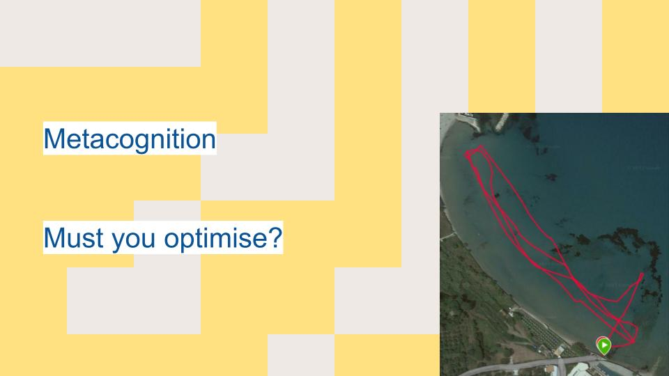

A lot of what I’m talking about here is metacognition. We can cultivate awareness of our own learning. Practices like self-regulation and monitoring can make people more effective learners. 

I swim a lot, and last year I set myself an aggressive swimming goal. And of course I planned on optimizing the hell out of it, I was gonna build an app connected to my fitness tracker and create visualisations and all that. So I looked up the API for my fitness tracker, and immediately discovered it wasn't going to work, the data was just not available in a suitable form for what I wanted to do. And I was appalled by this!

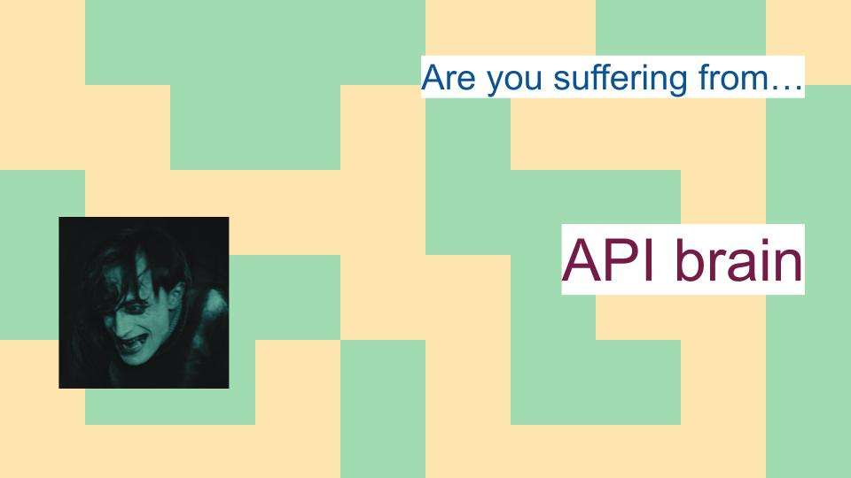

At the time I was experiencing API brain. I had been evangelising for this stuff so long I saw it as a baseline expectation, that data would be available in a fully programmable form. And by the way how badly has that view aged.

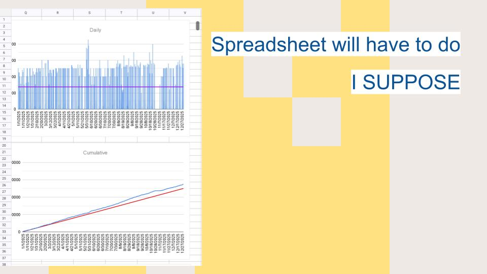

I came to the conclusion that a spreadsheet would be the easiest option, that I would just manually log my swims each day. I love spreadsheets so I'm not gonnae lie I was having the time of my life in there. But it kind of bothered me that it wasn’t efficient, I was duplicating data and wasting my own time. A few months in I came up with an idea to automate part of it, and I thought about it, but I decided not to. Because I’d realised I was getting something out of the process of logging my swim each day. But I wasn’t sure what.

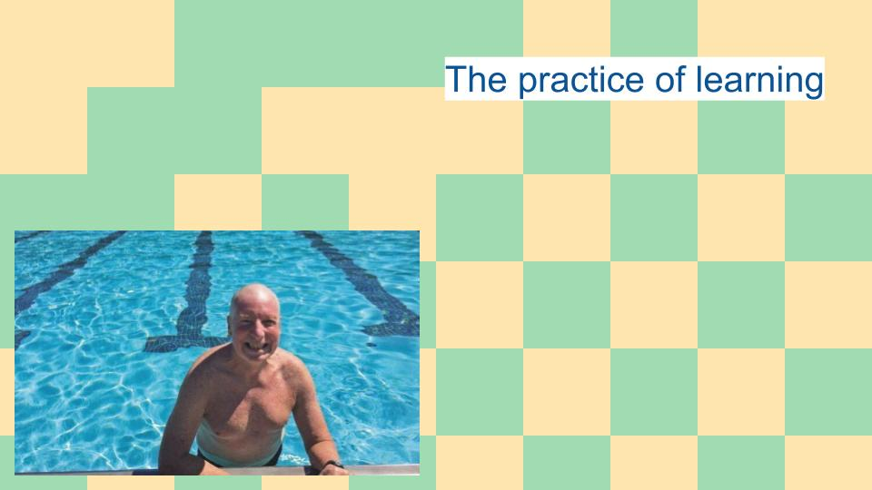

This is my swimming hero [Terry Laughlin](https://www.youtube.com/watch?v=hC8ZZZhabp4) who's no longer with us unfortunately. I was watching an old webinar where he talked about how his goal switched over the years from distance and speed to becoming a better swimmer. His goal was to be a better swimmer each time he got out of the water than when he got in. And one of the practices he used was as soon as he finished his swim, he would take copious notes. And when I heard him say it I thought, of course, he’s talking about reflection. That’s why I’m getting something valuable out of this spreadsheet. Now, I’ve taught people the value of reflection, but somehow I didn’t have the self awareness to realise that’s what I was doing.

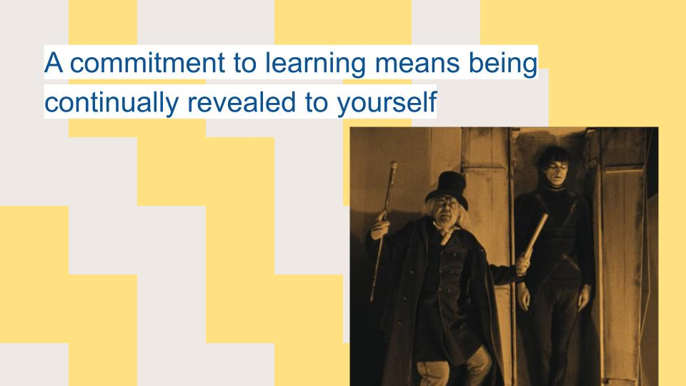

I think it's because learning is a practice that you commit to. When we look at people who are lifelong learners, continuous learners, they see it as a practice that you engage in, it’s never done, it’s never complete. One of my favourite things Terry Laughlin said was that since human beings are naturally very inefficient in water, that’s great, because we have a near infinite capacity for improvement. 

Although LLMs can make it easier for developers to avoid learning, they might actually give us new opportunities to support this kind of learning practice.

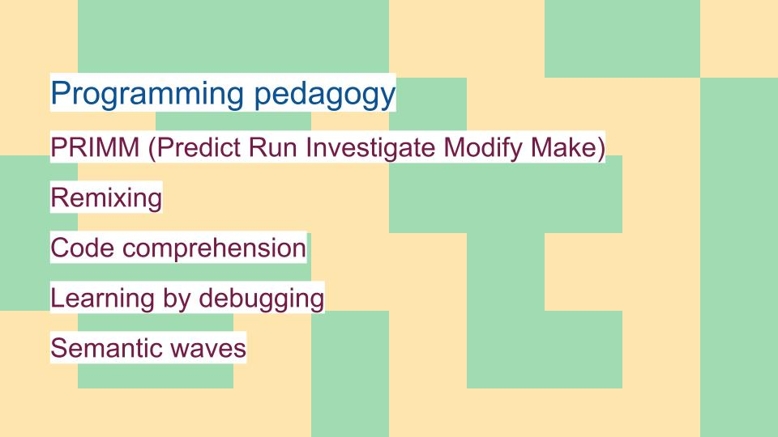

OK that was a bit philosophical, let's talk about something more tangible. There is a wealth of programming pedagogy that is extremely underused in industry. A lot of this is based on research carried out by the Raspberry Pi Foundation who develop models to teach schoolchildren coding skills. It's really helpful with adults too. I won’t linger on these because this is an entire talk in itself and [I already gave it a few years ago](https://developerrelations.com/developer-education/an-open-framework-for-developer-learning). But these are if anything more valuable with AI assisted coding. 

* The PRIMM model and remixing, which you might be familiar with from platforms like Scratch and Glitch, these both work on the basis that you start from an existing app and walk the learner through digging into the code and gradually taking ownership over it.
* Code comprehension is something we’ve neglected woefully, we wouldn’t teach people to write natural language without reading it, but that's what we do with code, and we're starting to feel the pain of that as we need to read more code. Our tooling for it is also not great.
* One of the best learning experiences I had was my masters project, where I had to extend an existing system, and had to fix a load of annoying bugs before I could build my own shiny new features which frustrated the hell out of me at the time but turned out to be the best learning experience I could have had. I had a glitch starter I never managed to complete where you would give the learner a broken project to fix. Again, learning by debugging is super valuable but our tooling is not optimised for it, but I think AI could help there.
* The semantic wave I want to talk about in more detail because it’s particularly relevant, this where we teach a topic by varying the levels of abstraction.

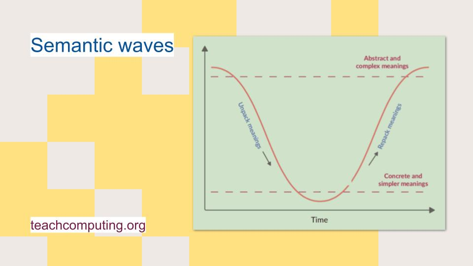

With the semantic wave, we introduce a topic at a high level of abstraction, then we come down the wave and dig into the implementation in code, hen we pack that back up into an abstract recap. And this pattern helps people to build mental models in programming. 

So it could be tempting to think that since we can generate code that we can just stay at the higher part of the wave, and teach computational thinking for example. But I don’t believe that will work, because spending time at the implementation level is part of how we create that repeatable feedback loop I mentioned. If we want people to acquire programming skills we will need to linger over the code.

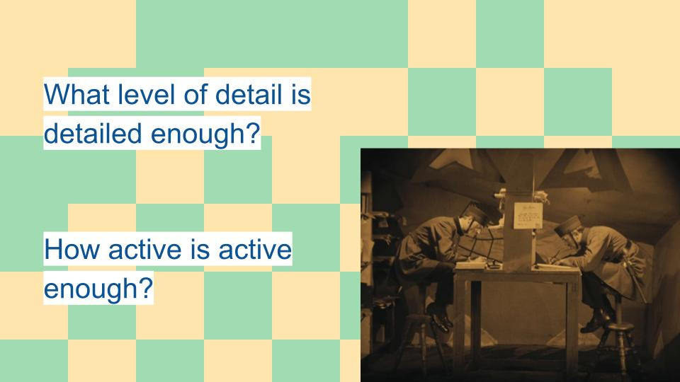

When I say we need to spend time lingering at the code level, does that mean we need to type every character, no. Can we use autocomplete, probably. Can we copy and paste, probably. We're going to find out what amount of coding is actually necessary to acquire skills the hard way eh. But if we learn from natural language literacy, we see that writing skills improve reading. So I would thoroughly recommend that anyone looking to become a software developer spend significant time writing code. 

We can also engage in other forms of active learning around the code. We can practice retrieval for example, where we might use a little pop quiz to stimulate the learner in retrieving what they've learned about the code. We can use other tactics like spacing and interleaving where we have gaps in our coverage of a topic and mix it up with others.

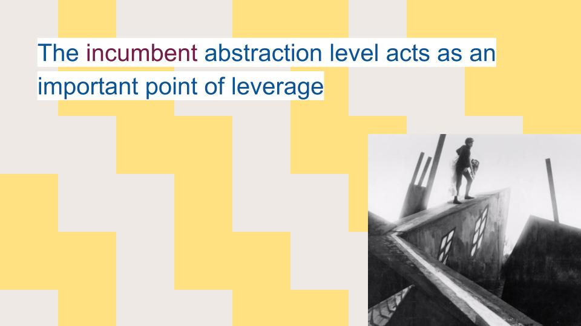

But there are other reasons to linger over the code. Whatever programming abstraction is providing training data will remain a valuable vantage point for understanding systems, for building those mental models that help us to work in more resilient ways. Because the source code LLMs are trained on didn’t just exist to tell machines what to do, it acted as a place where teams came together to reason about a system and make decisions about acting on it.

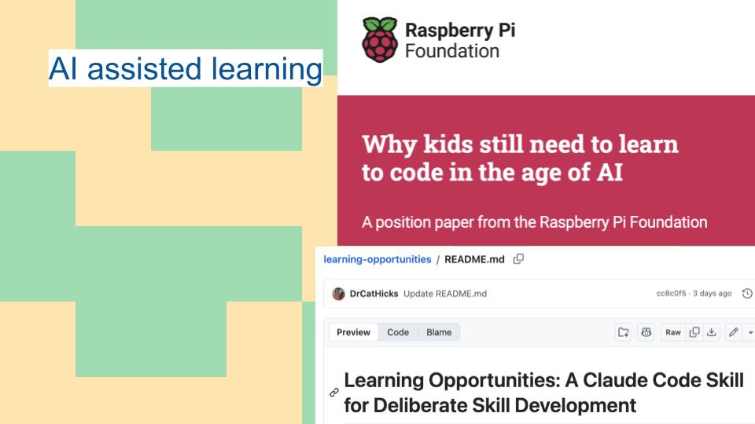

But there’s good news, we can use AI to enable learning. The Raspberry Pi Foundation have wholeheartedly embraced AI in their teaching resources, but in doing that they’ve [doubled down on the importance of learning to code](https://www.raspberrypi.org/blog/why-kids-still-need-to-learn-to-code-in-the-age-of-ai/). Dr Cat Hicks has created [Claude skills](https://github.com/DrCatHicks/learning-opportunities) that exemplify some of the active learning techniques I talked about here. What I’d love to see more of is breaking language model supports out of the chat or terminal and into the editing UI in IDEs, that’s what I’m working on.

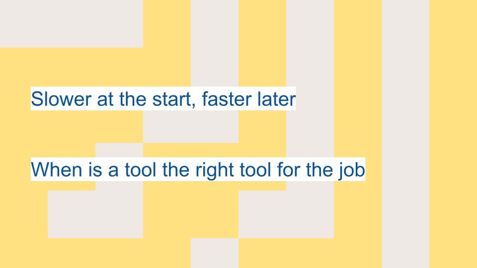

So in my side project, I'm using LLMs, but not to write code. Because it would defeat the purpose, writing the code is part of me exploring the problem. I wouldn’t be able to write a specification for it because I don’t know what it needs to do yet, I’m figuring that out by writing the code. It’s an investment in my future work on the problem. 

And this balancing of short and long term goals is going to be key to deciding when an AI tool is the right tool for the job. But the economic conditions that we work in make this way of building challenging.

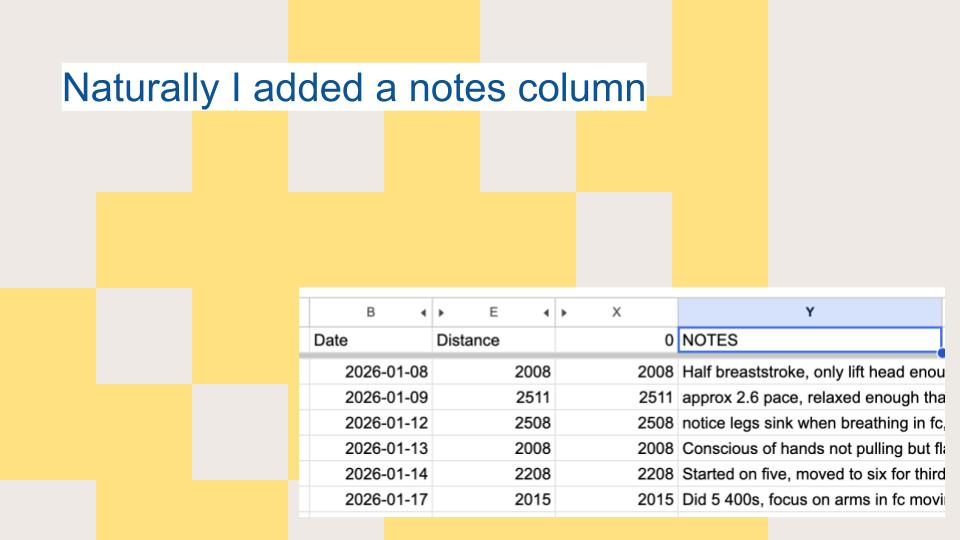

I know you’re all desperate to find out what happened with my swimming spreadsheet. Well I decided to embrace the goal of becoming a better swimmer, and added a notes column, it kind of became the goal. But my ability to pay the bills is not dependent on my swimming technique. 

But we find that overwhelmingly developers want to develop their craft and cultivate their skills, which will of course affect their ability to pay the bills later. We just don’t always create environments that support them to do that, or give them the tools to do it. To do that we have to get away from the production line mentality, where we confuse work with the artifact of it, we conflate valuable work with its output.

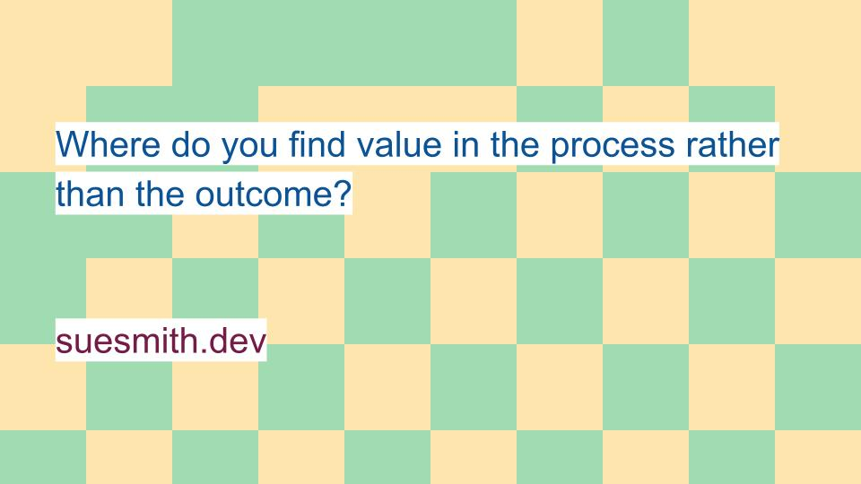

And on that note I would like to leave you with an invitation, to consider the places in your work where you find value in the process, rather than just in the outcome.

> Images:
>
> * The Cabinet of Dr Caligari (1920)
>
> * [generative-placeholders.stefanbohacek.com](https://generative-placeholders.stefanbohacek.com)
