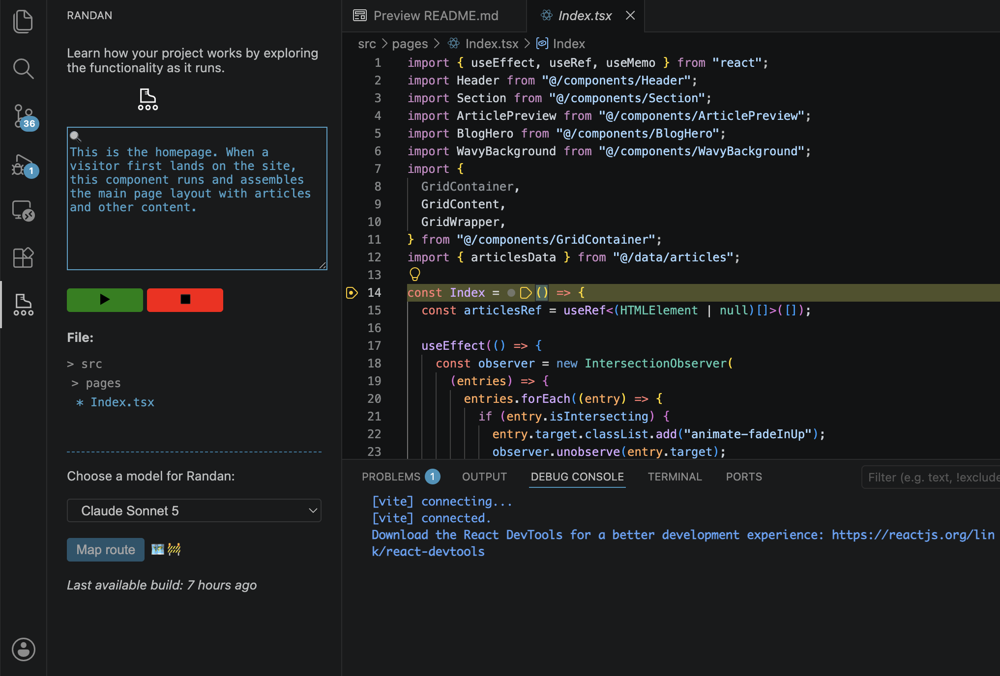
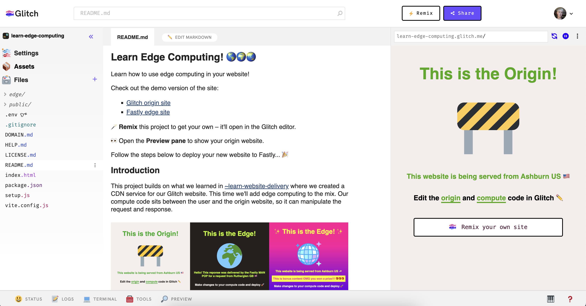

I’m [building a thing to help people understand codebases](https://www.randan.dev). A primary use case I have in mind is someone who has no coding experience but has vibe coded an application they now find themselves needing or wanting to understand. You’d be forgiven for assuming the hardest part of this would be helping people learn how their implementation works, but you might be wrong. 

My years teaching coding skills have shown me that what blocks progress and kills momentum is often not the code, but surrounding tasks like setting up developer environments, deployment and all that. My project uses the debug flow in VS Code, I’m getting frustrated at the lack of sensible defaults in place.

<!-- excerpt -->

## Getting off the start line

Last year I spent quite a lot of time in GitHub Codespaces. I was [trying to find paths](https://www.sue.codes/blog/whatfriction/) for people who were about to lose access to Glitch and Codespaces was the closest option I could find. I ended up [making various projects](https://dev.to/fastly/enabling-developers-in-github-codespaces-1l3a) for Fastly Compute onboarding, which was my job at the time – I also threw together one to make a [Glitch-y experience](https://github.com/SueSmith/glitchy-editing), in part for my own comfort. 

The content of my Codespaces projects is pretty basic – buttons in the UI that call shell scripts instead of the user having to type them into the terminal. Hardly groundbreaking stuff, but you’d be amazed at how enabling it was for new developers when they opened a Glitch project and it just ran, with a preview of their app popping up automatically for them to see – _updating as they made their edits, giving them a tangible feedback loop that fueled learning and creativity_.

> Some AI platforms leverage similar abstractions, like no dev environment setup and auto-deploy, but many users are discovering the reality of platform lock-in when they find they have little control over a project they’ve invested their time in.

Codespaces itself does attempt to do some setup automatically when you open a repo in the browser, but the code the container is executing doesn’t appear to be open or documented in any visible way. I’m trying to replicate it in VS Code for local development. It’s a case of hiding messy variation-wrangling because I don't want users to have to know this stuff right off the bat. I’m getting there but it's an annoying use of my time, for what I suspect would be relatively trivial for the platform to abstract away for so many new devs.

## Constructing crashmats

I believe LLM generated code can act as a starting point for people learning developer skills. It’s actually tried and tested coding pedagogy practice to start from an existing app, a pattern exemplified by Scratch. Here’s the problem though, moving from a vibe coding platform aimed at non-coders (lovable et al) to editing your code is like being dropped from a height like that car in the Blues Brothers. 

I started exploring what could help people in this situation last year, first by posting on the [vibe coding subreddit](https://www.reddit.com/r/vibecoding/comments/1pb9sfx/what_would_help_you_learn_about_your_code/), then by [sharing a variation on the container config](https://dev.to/suesmith/understanding-that-app-you-vibe-coded-5hig) I’d initially built for Glitch. 

Now I’m building this VS Code extension that uses the debugging flow. I am learning a lot about a lot of areas that are new to me: static and dynamic code analysis, language servers, debugging architecture, and of course making language model requests programmatically, not to mention the VS Code extension ecosystem itself. Grappling with these details is mostly helping me refine what I’m trying to do, like considering which semantic and structural signifiers about a codebase are valuable for understanding.

## Getting into the building

So now I’m learning about automatically generating launch configurations, because I don’t want users to have to figure that out for themselves when they’ve just exported a project. I want them to be able to see their project run, or at least attempt to run, as soon after exporting it as possible. I have a strong suspicion that the harder it is to get to that first step, the more likely they are to abandon the effort. 

Some years ago I was interviewing for a job in San Francisco. It was the first time I’d been there and only the second or third time I’d been to the US. I was feeling extremely out of my depth, coming from a poor background in Scotland, here I was walking into a skyscraper to be interviewed for a fancy tech job. It occurred to me I wasn’t actually sure what to do on entering the building, as some of these places don’t have the traditional reception person I was used to. Standing outside thinking, you seriously think you’re going to persuade these folk to give you a job when you don’t even know how to get into the building?

The barriers to opportunity are often not obvious to those of us who’ve already had it. If LLMs can generate entire working applications, surely we can give people environments that automate the tasks that send them away while also empowering them with control over the details they care about. Give folk a bloody run button in your IDE for goodness sake.

_I got that job btw._
