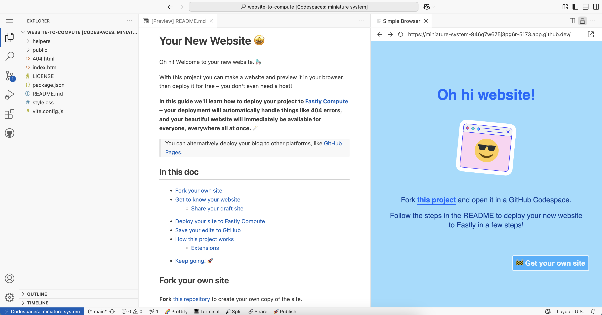
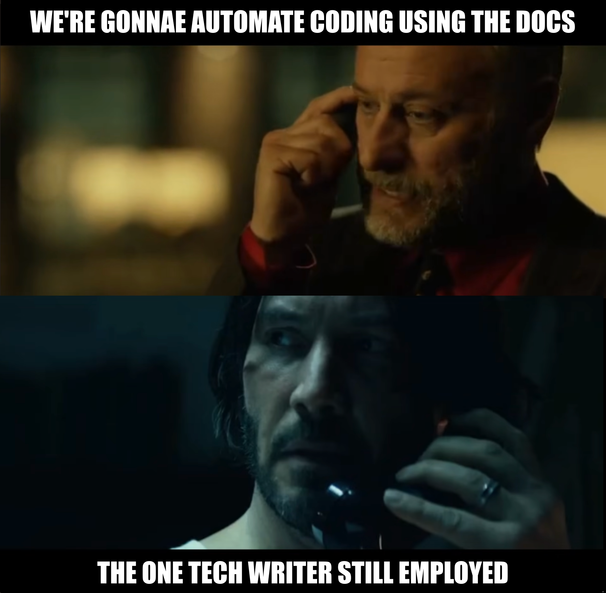

This time last year I was building paths for folk migrating apps away from Glitch. We were approaching the shutdown date and I needed alternatives for the Fastly onboarding projects I'd used as the foundation of the learning program I was leading – and that I’d candidly been hoping to integrate enough into product onboarding that the company would be persuaded to keep Glitch around. I also had a more personal need to figure out alternatives, as I'd relied on Glitch for teaching much longer than I'd been employed to work on it. 

<!-- excerpt -->

It's four years since Glitch was acquired by Fastly and therefore four years since I went to work there – I left last week. This isn't a dunk on my former employer, nor is it one of those our-incredible-journey things, just some reflections on what I learned during this particular part of mine, as I step into the next bit.

## Why I needed a replacement 

We’re finding out more than ever that [removing friction doesn’t necessarily empower people](https://www.sue.codes/blog/convenienceunderstanding/) when it comes to learning. One of the best things about Glitch was that it seemed to remove exactly the right kinds of friction, focusing the learner on the parts of making websites that resonated most with them. No dev environment setup or deployment barriers, just jumping straight into the functionality you wanted to craft. 

It was a phenomenal asset for onboarding developers with a tool or framework. That’s what I used it for at a few different startups including Postman, and why I was able to embed it in various Fastly enablement processes. It let you get straight to the part where you figure out how to interact with a particular dev product, and form the mental models to do so effectively, in Fastly’s case integrating edge computing into your site.

> None of this invalidates wanting to spin up a website with no intention of learning about the implementation, there's a reason WordPress has remained so popular for so long. **Being able to choose which details are worth paying attention to is the trick.**

Many platforms have taken inspiration from Glitch – building in the browser is much more common now, so is remixing from a template (a pattern hugely popularised by Scratch). In order to preserve some semblance of the easy flow I’d been able to create in Glitch, I built [custom dev container configurations](https://dev.to/fastly/enabling-developers-in-github-codespaces-1l3a) to create a kind-of-sort-of similar flow in GitHub Codespaces. It helped me not completely abandon the approach, but suffice it to say it wasn’t Glitch. It’s basically the VS Code editor in the browser, so the experience is overwhelming for new developers and there’s a pretty severe limit to how effectively you can mitigate that.

## What has changed

The advent of LLMs and changes to the web itself make what Glitch was, in practical terms at least, no longer sensible. Letting anyone spin up a live website in seconds was both expensive from an infrastructure perspective and incredibly prone to abuse, and that was before AI agents.
There were also abstractions that didn’t age quite so well. Not having to think about deployment was a blessing right up until it became a curse. The git rewind feature fared similarly. Starting from a small set of app templates seems quaint when you can use a prompt to generate anything you like – although there were advantages to that, and I suspect they partially explain why LLMs are not enabling creation the way some expected them to.

## What we still need 

As anyone familiar with creative tooling will tell you, starting from a blank slate isn’t always ideal when it comes to stimulating users. A blank chat box is no different. That's why learning platforms like Scratch focus so heavily on the remix pathway. What happens after you generate your starter project has a huge influence on whether or not you continue. What is in there really matters.

> Removing barriers that kill momentum – without disadvantaging the learner later – is a [balancing act](https://www.sue.codes/blog/tradeoffs/) that needs continually revisited.

I recently tried exporting a simple website from a vibe coding platform and found it a frustrating dead end, with zero in-project guidance and mystifying implementation choices. *There was no feasible path forward that involved touching this code.* Contrast that with the Glitch Hello apps – they were painstakingly designed to act as **jumping off points** for people learning a new framework. The preview, code comments, and project docs were all curated to guide the learner through first steps that set them up to keep going. You know, the kind of material LLMs are trained on. 

> The claim is that we don't need those jumping off points anymore, but without them, how will anyone learn to swim?

Anil described Glitch as a ["yes code"](https://blog.glitch.com/post/yes-code-coding-with-ai) platform, distinct from "no code" where the user was encouraged not to even look at the code generated. I think it’s safe to say that most LLM products aimed at people without prior experience fall firmly into the no code camp. There’s an assumption that no one needs to know about code anymore, [I think that’s a mistake](https://www.sue.codes/blog/stillteach/). We still need people to [understand code](https://www.sue.codes/blog/devtopics/) in order to understand how systems built in software work, and to shape them reliably. So where are the "yes code" LLM platforms?

**We need software building experiences that design friction with intention, being deliberate about what is abstracted away and what is left in the learner's path.** What is exposed should be the details that equip the learner with whatever understanding serves their goals (or their organisation's). Balancing short and long term goals is, as always, where we find tension we'll want to manage effectively – if we're to leave the experience empowered, rather than dependent on automations we don't fully understand.

## What doors have opened?

People who are being empowered through building with LLMs are overwhelmingly doing it in conjunction with support from others – being able to initialise a project only takes you so far. Claims that LLMs democratise access to the opportunities that come from making software are popular, but in reality that involves a lot more than generating code from a natural language prompt.

I believe LLMs give us a host of new paths for people learning to make software, but not through a chat window that separates you from coworkers and peers. We could do a lot more to build tooling around LLMs that would better support learning. Might be an idea to [pay attention to the pedagogy](https://www.sue.codes/blog/pedagogyway/) eh. 

> I'm available for [consulting work](https://www.buoyancies.com) now btw.
